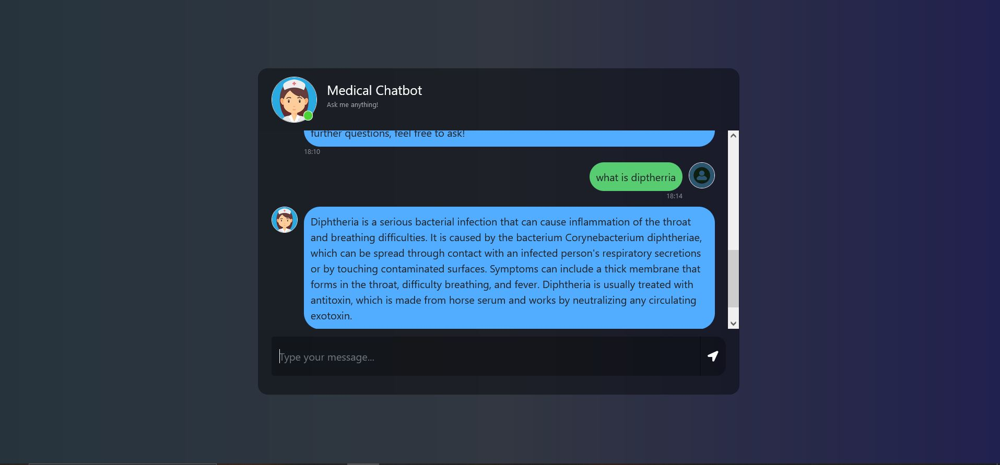

# Medical_chatbot_using_LLaMA2_end_to_end
A Retrieval-Augmented Generation (RAG) based Medical Chatbot. With the base model as Llama2 from Meta, the Retrieval system uses a medical document as corpus to generate context-rich output.

Below is the snap of chatbot:


create the conda environment:
```bash
conda create -n mchatbot python=3.8 -y
```
To Activate the environment:
```bash
conda activate mchatbot
```

To install the dependency packages:
```bash
pip install -r requirements.txt
```

To load the embedding vectors into Pinecode:
```bash
python store_index.py
```

To start the server:
```bash
python app.py
```
Create a .env file in the root directory and add your Pinecone credentials as follows:
```bash
PINECONE_API_KEY = "xxxxxxxxxxxxxxxxxxxxxxxxxxxxx"
PINECONE_API_ENV = "xxxxxxxxxxxxxxxxxxxxxxxxxxxxx"
```

Download the quantize model from the link provided in model folder & keep the model in the model directory:
```bash
## Download the Llama 2 Model:

llama-2-7b-chat.ggmlv3.q4_0.bin


## From the following link:
https://huggingface.co/TheBloke/Llama-2-7B-Chat-GGML/tree/main
```

Open Localhost:
```bash
open up localhost:8080
```

